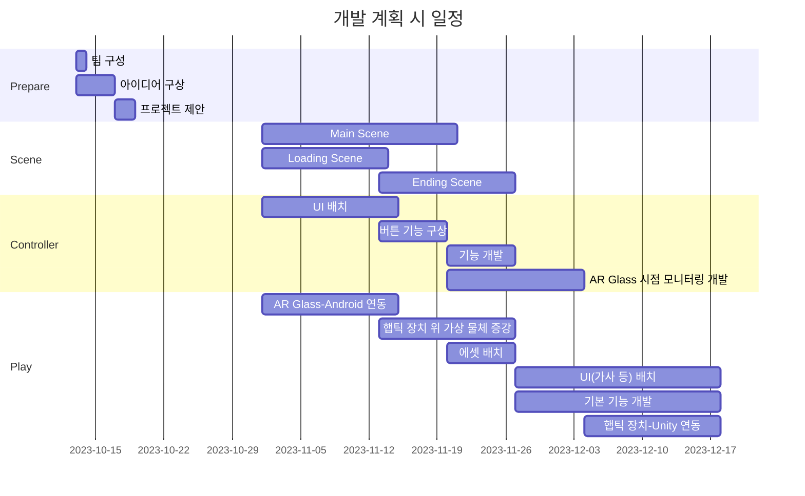
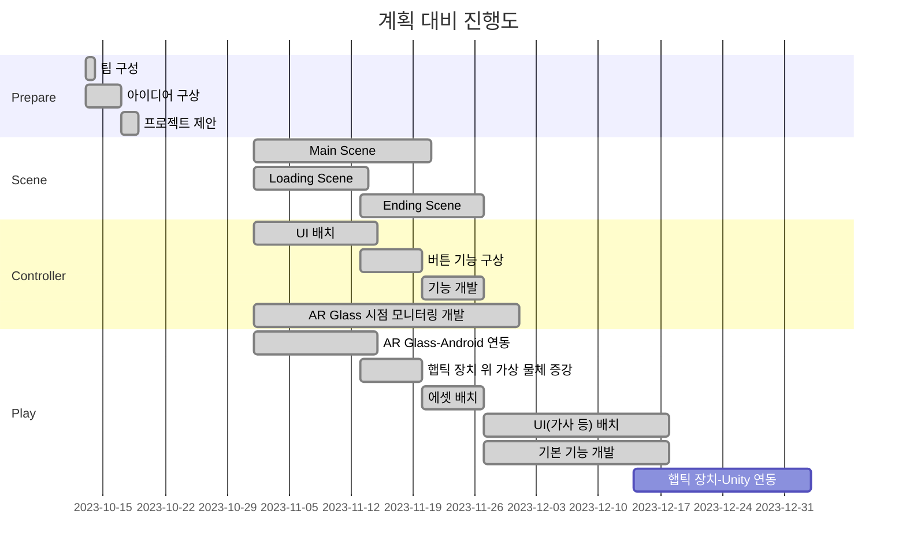

# **AmazingAR**

### 소개
오픈소스 프로젝트를 위한 레포지토리로, AR Glass 기반으로 개발한 교육 및 놀이 콘텐츠 **Amazing AR**입니다.

#### 팀 구성원
| 역할   | 학번 |팀원   |  이메일 |
| ------ | ------ | ------ | ------ |
| **팀장**   | 20210104 | 김경미  | kkm417@kumoh.ac.kr |
| 팀원   | 20210347 | 김현서  | gus952@naver.com |
| 팀원   | 20210862 | 이유정 | lyj98076@naver.com |
| 팀원   | 20210908 | 이지윤 | dl11258963@kumoh.ac.kr |

#### 개발 기간
2023년 10월 13일 ~ 2023년 12월 12일

#### 동영상 링크
https://youtu.be/ngtpPCOMI8k 

 

## 프로젝트 개요

### 개발 배경

   

>https://m.dongascience.com/news.php?idx=54780 
http://www.grinews.co.kr/front/news/view.do?articleId=12656 
-  AR 기술은 현재 세계에서 가상 정보를 덧붙여 확장 현실을 제공한다. 이러한 AR 기술은 교육, 엔터테인먼트, 과학 등 여러 분야에서 두각을 보여주고 있다.

- 아동은 원인과 결과를 보다 명확하게 이해하고 학습하기 위해, 시각적 경험과 상호작용을 통해 학습하는 것이 유익하다.  
   이러한 아동을 대상으로 한 교육 및 놀이 콘텐츠를 개발함으로써 그들의 창의성과 인지 능력 증진에 도움을 주고자 한다.

### 필요성
- 다양한 경험 제공
  -  AR 기술을 이용한 음악놀이 콘텐츠를 개발함으로써 아동에게 다양한 환경과 학습을 경험할 수 있는 기회 제공 가능
- 상호작용 강화
  - 악기, 음향 요소 그리고 음악 놀이를 포함한 AR 기술을 통해 일상생활에서 볼 수 없는 악기들을 시각적으로 제시하면서, 아동이 악기와 음악을 체험하고 상호작용할 수 있는 교육적 환경 제공
- 인지 능력 향상
  - 음악 놀이 콘텐츠를 통해 아동의 감각 지각 능력, 상상력, 문제해결 능력 등 향상 가능
 
 

## 프로젝트 개발 내용

### 최종 목표
- 본 프로젝트의 최종 목표는 아동에게 다양한 경험을 제공하고, 이를 통해 개인적인 학습 경험을 가능하게 하는 것이다.  이를 위해 다음과 같은 주요  기능을 개발하였다.
     1. 콘텐츠 선택 : 다양한 음악 놀이 콘텐츠를 제공하여 사용자가 다양한 악기를 체험할 수 있도록 한다.
     2. 음악 놀이 플레이 : AR Glass를 활용하여 사용자가 현실적인 음악 놀이를 경험하고 즐길 수 있도록 한다.
     3. 음악 놀이 모니터링 : 관리자는 사용자의 음악 놀이 진행 상황을 모니터링하고 관리 및 확인함으로써 효과적인 피드백을 제공하여 개인화된 학습 경험을 지원한다.
     4. 결과 분석 : 음악 놀이가 종료되면, 관리자는 사용자의 음악 놀이 플레이 결과를 확인할 수 있다.
     5. 환경 설정 : 각 사용자에 맞게 프로그램의 배경 음악(BGM), 효과음 음량을 조절할 수 있으며, 기기와의 연동 여부를 확인할 수 있다.

### 개발 내용

#### 1. 전체 시스템 구성도

   </img>

- 사용자가 AR 글래스를 착용하고 스마트폰을 통해 AR 애플리케이션을 활성화하면 음악 놀이 콘텐츠가 시각화되고 실제 환경으로 증강된다.
- AR Glass를 통해 가상 객체 배치 및 음악을 통해 시각 및 청각 피드백을 제공한다.
- 햅틱 스틱은 사용자의 입력을 받아들이고 촉각 피드백을 제공한다. 이러한 햅틱 스틱을 사용하여 햅틱 패드를 타격할 수 있다.
- 햅틱 패드는 타격 시 인가되는 압력을 측정한다.
- 즉, 가상 환경에서의 시각적 경험과 음악에 의한 청각적 피드백뿐만 아니라, 햅틱 스틱을 통한 촉각적 피드백까지 통합된 경험이 제공된다.   이로써 사용자는 다양한 감각을 활용하여 더욱 몰입하고 개인화된 학습 및 놀이 경험을 즐길 수 있다.

#### 2. 주요 기능별 씬(Scene) 흐름도

   

   <em>전체 Scene 흐름</em>

 
1) 콘텐츠 선택

   

   <em>콘텐츠 선택 기능 Scene 흐름</em>

   - Loading Scene 뒤, Main Scene으로 이동하며, Main Scene의 ‘콘텐츠 선택’ 버튼을 누르면 콘테츠 선택 Scene으로 넘어가게 된다. 제공된 콘텐츠 중 원하는 콘텐츠를 선택하면 된다. 현재 제공된 콘텐츠는 두 가지이며, 추후 더 다양한 콘텐츠가 추가될 예정이다.  
  

2~3) 음악 놀이 플레이 및 모니터링

   

   <em>음악 놀이 플레이 및 모니터 Scene 흐름</em>

   - 콘텐츠 선택 시, 음악 놀이 플레이 및 모니터링 Scene으로 전환된다. 핸드폰 컨트롤러의 화면에서는 모니터링을 위해 AR Glass 화면이 캡쳐되어 제공되며, 음악 놀이 관리 기능을 포함하는 버튼이 제공된다.
   - 제공되는 버튼은 총 네 가지로, 상단 좌측부터 순서대로 ‘재생’, ‘다시 시도’, ‘음악 감상’ 버튼이다. 하단 우측에 ‘결과 분석’ 버튼으로 음악놀이가 종료되고 플레이 결과를 확인할 수 있는 화면으로 이동한다.
   - 상단에서는 노래 가사가 나타나며, 박자에 맞게 막대바가 나타나 사용자는 막대바가 떨어지는 리듬에 맞춰 햅틱 패드를 치게 된다.  
  

4) 결과 분석

   

   <em>결과 분석 Scene 흐름</em>

  - 핸드폰 컨트롤러의 ‘결과 분석’ 버튼을 누르게 되면, 결과 분석 Scene으로 이동한다.
  - 해당 Scene에서는 사용자의 음악 놀이 플레이 결과 및 버튼이 배치되어 있다.
  - 우측 하단의 ‘콘텐츠 선택’ 버튼과 ‘한 번 더’ 버튼으로 사용자가 콘텐츠를 다시 선택하거나 선택했던 콘텐츠를 재시도 할 수 있도록 한다. 
  

5) 환경 설정

   

   <em>환경 설정 Scene 흐름</em>

   

   - 각 Scene 마다 상단 우측에 위치한 설정 버튼을 탭하면 환경 설정 화면이 팝업으로 나타나게 된다. 배경음악 및 효과음 크기 조절 및 기기 연동 유무를 확인할 수 있다.
  

#### 3. 주요 기능 개발 내용

   

   <em>VideoCapture2Local Example</em>

- 주요 멤버 변수는 m_Previewer이며, NRPreviewer 객체로 녹화된 비디오의 미리보기를 표시하는데 사용한다.
- StartVideoCapture(): 비디오 캡처를 시작한다. NRSDK를 사용하여 비디오 모드를 설정하고 영상 녹화를 시작한다.
- StopVideoCapture(): 현재 녹화 중인 비디오를 중지한다. NRSDK를 사용하여 녹화를 중지하고 녹화된 미리보기를 NRPrieviewer에 전달한다.
 

   

   <em>NRPreviewer</em>

- 주요 멤버 변수는 아래와 같다.
  1. Root : 비디오 미리보기 화면의 루트 GameObject이다.
  2. PreviewScreen : 비디오 미리보기를 표시하는 RawImage UI 요소이다.
  3. StateIcon : 비디오 재생 상태를 나타내는 Image UI 요소이다.
- SetData(Texutre tex, bool isplaying): NRVideoCapture에서 전달된 녹화된 비디오의 미리보기를 설정한다.
- SwitchPerview(bool flag): 미리보기 화면을 표시하거나 숨기는 기능이지만, 프로젝트에서는 화면을 계속 표시하도록 한다.
 

   

   <em>ImageTrackableBehavior</em>

- NRPreviewer 클래스는 VideoCapture2LocalExample 클래스에서 사용되는 중요한 UI 컴포넌트들을 캡슐화하고 있다. VideoCapture2LocalExample 클래스에서 NRPreviewer 객체를 사용하여 녹화된 비디오의 미리보기를 제어한다.
- 주요 멤버 변수는 없으며, OnTrackSuccess 함수와 OnTrackFail 함수가 존재한다.
   - OnTrackSuccess(string, string, Matrix4x4) : 이미지 트래킹에 성공했을 때 호출되며, 트래킹된 이미지의 ID, 이름 및 변환 매트릭스(poseMatrix)를 전달받는다. 해당 이미지 트래킹이 성공하면, Rendere와 Collider 컴포넌트를 가진 요소들을 활성화한다. poseMatrix를 사용하여 객체의 위치와 회전을 설정한다.
   - OnTrackFail(): 이미지 트래킹이 실패했을 때 호출된다. 이미지 트래킹이 실패하면, 자식 객체들 중에서 Renderer와 Collider 컴포넌트를 가진 요소들을 비활성화 한다.
 

   

   <em>NRHandMeshVisual</em>

- 주요 멤버 변수로는 m_HandPrefab, m_HandMeshJoint, m_HandLengthJoints, m_HandLength 총 4가지가 존재한다.
- CreateMeshVisuals(): 클래스는 손의 Mesh를 시각적으로 나타낸다.
- InitHandLength(): 손의 길이를 초기화한다.
- OnEnable(): 손 추적이 활성화될 때의 작업을 정의한다.
- OnDisable(): 손 추적이 비활성화될 때의 작업을 정의한다.
- OnHandTracking(): 추적이 활성화되면 손의 상태 및 손의 관절 상태를 업데이트한다.
- UpdateWristByMiddle(HandState): 손목과 중지 사이의 관계를 업데이트한다. 손목의 위치와 회전을 조정하여 손가락의 중지 관절 사이의 거리를 유지한다.
- OnHandTrackingStopped() : 손 추적이 중지되었을 때의 동작을 정의하며 손 Mesh를 비활성화 한다.

#### 4. 장르 특성화 방안

- 실제 환경과 상호 작용
   - NRSDK를 사용하여 AR Glass가 주변 환경을 실시간으로 감지하고 이에 반응하도록 구현한다. NRSDK는 AR Glass를 사용하는 증강현실 애플리케이션을 개발하기 위한 SDK이다. NRSDK의 NRCameraRig를 사용하여, AR 애플리케이션에서 카메라와 사용자의 시각적 표현을 관리하고 조정할 수 있다.
 
- 증강 현실 학습 게임
   - 유아용 교육 콘텐츠를 개발할 때, AR을 활용한 학습 게임을 구현한다. 유아가 주변 환경과 상호작용하는 놀이 콘텐츠를 개발한다.

- 진행 상황 공유 및 피드백 기능
   - 휴대폰 컨트롤러를 통해 보호자 또는 관리자와 연동하여 유아의 학습 및 놀이 상황을 실시간으로 공유하고 피드백을 제공한다. 이를 통해 보호자 또는 관리자와 유아 간의 상호작용을 강화하고 학습 경험을 공유한다.

### 오픈 소스 활용

#### 1. 활용한 오픈 소스 소개
- NRSDK
   - NRSDK(Nreal SDK)는 Nreal의 혼합 현실 플랫폼을 위한 Unity 엔진 기반의 개발 도구이다. Mixed Reality 지원, 3D 트래킹 및 공간 인식, Unity 통합, Nreal Light 컨트롤러 지원, 영상 및 음향 처리 기능이 특징이다. 이러한 기능을 통해 현실 세계와 가상 현실을 융합한 차별화된 경험을 제공하는 애플리케이션 개발이 가능하다.
- MAXST
   - MAXST AR SDK는 MAXST의 AR 애플리케이션 개발 도구로, 강력한 트래킹 기술, 3D 오브젝트 인식, 마커리스 트래킹, Unity 통합, 다양한 플랫폼 지원과 같은 다양한 기능을 제공한다. 이를 통해 AR을 활용한 애플리케이션 개발에 유용하게 활용 가능하다.
- Unity Asset Store
  - Unity Asset Store에는 다양한 에셋이 있으며, 오픈소스 에셋을 포함하고 있다. 오픈소스 에셋을 구매하거나 무료로 다운로드하여 프로젝트에 활용할 수 있다. 해당 에셋들은 Unity 엔진과 원활하게 통합되어 있어 Unity 에디터에서 손쉽게 적용 가능하다. 그 중, 이 프로젝트에 활용한 오픈소스는 아래와 같다.
  > Terrain Sample Asset Pack : https://assetstore.unity.com/packages/3d/environments/landscapes/terrain-sample-asset-pack-145808  
     Nature Starter Kit 2 : https://assetstore.unity.com/packages/3d/environments/nature-starter-kit-2-52977  
     Realistic Tree 9 [Rainbow Tree] : https://assetstore.unity.com/packages/3d/vegetation/trees/realistic-tree-9-rainbow-tree-54622  
     Real Stars Skybox Lite : https://assetstore.unity.com/packages/3d/environments/sci-fi/real-stars-skybox-lite-116333  
     Planets of the Solar System 3D : https://assetstore.unity.com/packages/3d/environments/planets-of-the-solar-system-3d-90219  
     Space Star Field Backgrounds : https://assetstore.unity.com/packages/2d/textures-materials/space-star-field-backgrounds-109689  
     Wooden Floor Materials : https://assetstore.unity.com/packages/2d/textures-materials/wood/wooden-floor-materials-150564  
     Christmas Decoration Props : https://assetstore.unity.com/packages/3d/props/interior/christmas-decoration-props-159202  
     Christmas toys : https://assetstore.unity.com/packages/3d/props/interior/christmas-toys-106607  
     Christmas and Birthday Presents Pack : https://assetstore.unity.com/packages/3d/props/interior/christmas-and-birthday-presents-pack-157090  
     Japanese School - Stylized : https://assetstore.unity.com/packages/3d/environments/japanese-school-stylized-221256  
     Minimalist Christmas : https://assetstore.unity.com/packages/3d/environments/minimalist-christmas-50549

 
 

#### 2. 오픈 소스 사용법 및 활용한 기능

   

   <em>NRSDK 및 MAXST의 사용한 Script</em>

- NRSDK의 스크립트 NR Virtual Displayer, NR Previewer, NR Hand Mesh Visual 스크립트를 활용하여 컨트롤러 및 모니터링 기능, 손 증강 구현
- MAXST의 ImageTrackableBehavior 스크립트를 활용하여 QR code 추적을 통해 객체가 증강되어 배치되도록 구현
 
 

1) NRSDK

   

   <em>NRSDK의 NR Virtual Displayer 활용</em>

   - NR Virtual Displayer
        - 컨트롤러 기능을 제공하며, 이를 활용하여 원하는 버튼이나 기타 UI를 디자인하였다.
 

   

   <em>NRSDK의 NR Hand Mesh Visual 활용</em>

- NR Hand Mesh Visual
     - 손 증강 기능을 담당하며, AR Glass의 카메라를 활용하여 사용자의 손을 추적하고 악기 스틱과 함께 시각적으로 표현하였다.
     - 스크립트의 Start에서 CreateMeshVisual 함수를 호출하여 손을 가져오게 되는데, CreateMeshVisual 내에 InitHandLength 함수는 손, 손가락 관절을 초기화하는 기능을 포함하고 있다.
     - On Hand Tracking 함수에서는 CreateMeshVisual 함수에서 초기화해준 손, 손가락 관절 프리팹이 할당되어 있으며, 사용자 손의 추적 상태에 따라 손 모델을 시각화해주는 기능을 담당한다.
 

   

   <em>NRSDK의 NR Previewer 활용</em>

- NR Previewer
     - 모니터링 기능을 제공한다. 해상도, 프레임 속도 등의 요소로 카메라를 설정하고 OnStartedVideoCaptureMode를 호출하여 사용하게 된다.
     - 캡쳐모드가 성공적으로 시작되면 비디오 녹화를 시작한다. 비디오 캡처의 미리보기 텍스처를 설정해주게 되며, 이를 활용한 녹화 중에 실시간으로 미리보기를 제공하여 모니터링 기능을 가능하게 하였다.

 
 

2. MAXST

   

   <em>NRSDK의 ImageTrackableBehavior 활용</em>

- ImageTrackableBehavior
     - 환경 증강 기능을 제공한다.
     - Unity에서 설정해준 이미지를 바탕으로 이미지(QR code) 추적이 성공하면, 해당 이미지의 위치와 회전 정보를 가져와 콘텐츠의 가상 환경을 해당 위치에 배치하여 증강시킨다.

 
 

3. Unity Asset Store
   - Unity Asset Store에서 원하는 에셋을 선택한 후, 다운로드 한다.
   - Unity 에디터로 돌아가 프로젝트를 연 후, Unity 에디터의 Window - Asset Store - My Assets 탭에서 에셋을 확인한다.
   - 원하는 에셋을 Import 하여 프로젝트에 추가하여 활용하였다.

 
 

### 개발 체계

#### 1) 개발 일정

- 개발 계획 시 일정 대비 개발 진행도 별도 표시

 

   -  AR Glass 시점 모니터링 개발 및 햅틱 장치 위 가상 물체 증강 개발은 예정보다 빠르게 진행되었다.
   - 햅틱 장치-Unity 연동은 햅틱 장치 미완성으로 인해 예정 기간 내에 완성하지 못하였으며, 완성되는 대로 프로젝트에 연동 예정이다.

#### 2) 업무 분장
|팀원   |  업무 |
| ------ | ------ |
| 김경미  | - **프로젝트 진행 관리**  - **음악놀이 개발 총괄**  - 햅틱 장치 위 가상 물체 증강 - 음악 놀이 기본 기능 개발 - 햅틱장치-Unity 연동 - 음악놀이 UI (가사 등) 배치 |
| 김현서  | - **컨트롤러 개발 총괄**  - 컨트롤러 UI 배치  - AR Glass 시점 모니터링 개발  - 컨트롤러 버튼 기능 구상  - 컨트롤러 기능 개발 |
| 이유정 | - 음악놀이 에셋 배치  - Scene 구상 보조  - Loading Scene |
| 이지윤 | - Ending Scene  - Main Scene  - 음악놀이 에셋 배치  - 컨트롤러 UI 배치  - 음악놀이 UI (가사 등) 배치 보조 |

#### 3) 협업 방법 및 활용 툴
| 협업 내용   |  협업 방법 및  활용 툴 |
| ------ | ------ |
| 회의 방법  | - 대면 및 비대면 회의 모두 활용  - 대면 회의는 필요한 경우 직접 만나서 의사 소통 및 논의 진행 - 비대면 회의는 Discord를 이용하여 화상 또는 음성으로 진 |
| 문서 및 자료 공유  | - Google 공유 폴더 사용하여 프로젝트에 필요한 문서 및 자료들을 효율적으로 관리하고 공유 - 프로젝트 관련 문서, 회의록, 파일 등이 Google Drive를 통해 공동 작업 및 업데이트  |
| Unity 개발환경 | - Unity의 'Export Package' 기능을 활용하여 프로젝트의 일부 또는 특정 기능들을 패키지로 만들어 공유  - 개발된 패키지는 다른 개발자들이 손쉽게 프로젝트에 통합할 수 있도록 함 | 

 

### 사용 설명서
**1) 햅틱패드-햅틱스틱 연결 확인** 
&nbsp;&nbsp;&nbsp;1. 애플리케이션을 실행한다.  
&nbsp;&nbsp;&nbsp;2. 화면 우측 상단에 위치한 설정 버튼(</img>)을 탭한다.  
&nbsp;&nbsp;&nbsp;3. 설정 화면이 나타나면, 팝업 창에서 햅틱패드와 햅틱스틱의 연결 상태를 확인할 수 있다.  
&nbsp;&nbsp;&nbsp;&nbsp;&nbsp;- 초록색으로 활성화되고 '연결됨' 메시지가 표시되면, 성공적으로 연결된 상태이다.  
&nbsp;&nbsp;&nbsp;&nbsp;&nbsp;- 초록색이 비활성화되고 '연결 안 됨' 메시지가 표시되면, 연결이 되지 않은 상태이다.  
       
  **2) 상단 위치 기본 기능 버튼** 
   - 화면 상단에 위치한 기본 기능 버튼들은 화면에서 항상 제공된다.  
      - 설정 버튼(</img>) : 설정 화면을 띄운다.  
      - 홈 버튼(</img>) : 홈 화면으로 이동한다.   
      - 뒤로가기 버튼(</img>) : 이전 화면으로 이동한다.  
    
  **3) 음악 놀이 진행** 
&nbsp;&nbsp;&nbsp;3-1) 콘텐츠 선택 
&nbsp;&nbsp;&nbsp;&nbsp;&nbsp; 1. 애플리케이션을 실행한다. 
&nbsp;&nbsp;&nbsp;&nbsp;&nbsp; 2. 로딩 화면이 표시된 후, 자동으로 홈 화면으로 이동한다. 
&nbsp;&nbsp;&nbsp;&nbsp;&nbsp; 3. 콘텐츠 선택 전, 객체 증강을 위해 QR 코드를 먼저 인식해준다. 
&nbsp;&nbsp;&nbsp;&nbsp;&nbsp; 4. 홈 화면에서 하단 중심에 위치한 '콘텐츠 선택' 버튼(</img>)을 탭하면, 콘텐츠 선택 화면으로 전환된다. 
&nbsp;&nbsp;&nbsp;&nbsp;&nbsp; 5. 제공된 다양한 콘텐츠 중 원하는 하나를 선택한다. 
&nbsp;&nbsp;&nbsp;&nbsp;&nbsp; 6. 선택한 콘텐츠에 따라 핸드폰 컨트롤러와 AR Glass 화면이 전환된다. 
  
&nbsp;&nbsp;&nbsp;3-2) 음악놀이 기능 
&nbsp;&nbsp;&nbsp;&nbsp;&nbsp;- 선택한 콘텐츠로 화면이 전환되면, 아래와 같은 음악놀이를 제어할 수 있는 버튼들이 제공된다. 
&nbsp;&nbsp;&nbsp;&nbsp;&nbsp;&nbsp;&nbsp;- '선택한 콘텐츠' 재생 버튼(</img>) : 선택한 콘텐츠로 음악 놀이를 시작하려면 해당 버튼을 탭한다. 
&nbsp;&nbsp;&nbsp;&nbsp;&nbsp;&nbsp;&nbsp;- '한 번 더!' 다시 시작 버튼(</img>) : 선택한 콘텐츠를 처음부터 다시 음악 놀이를 시작하고 싶을 때 사용한다. 
&nbsp;&nbsp;&nbsp;&nbsp;&nbsp;&nbsp;&nbsp;- 음악 감상 버튼(</img>) : 선택한 콘텐츠를 감상 모드로 진행하고 싶을 때 해당 버튼을 탭하며, 음악 놀이 없이 음악만 재생된다. 
&nbsp;&nbsp;&nbsp;&nbsp;&nbsp;&nbsp;&nbsp;- 결과 분석 버튼(</img>) : 음악 놀이를 종료하며, 결과 화면으로 이동한다. 
&nbsp;&nbsp;&nbsp;&nbsp;&nbsp;&nbsp;&nbsp;- 손 증강 활성화 버튼(</img>) : 해당 버튼을 탭하면, 사용자의 손을 따라 햅틱 스틱을 가진 가상의 손으로 증강되어 나타난다. 

&nbsp;&nbsp;&nbsp;3-3) 결과 분석 
&nbsp;&nbsp;&nbsp;&nbsp;&nbsp;- 결과 분석 버튼(</img>)을 탭하면, 결과 분석 화면으로 이동한다. 
&nbsp;&nbsp;&nbsp;&nbsp;&nbsp;- 햅틱 장치를 통해 얻은 각각의 점수를 확인할 수 있다. 
&nbsp;&nbsp;&nbsp;&nbsp;&nbsp;- 햅틱 장치에서 얻은 점수를 기반으로 계산된 총 점수가 우측에 가장 크게 나타난다. 
&nbsp;&nbsp;&nbsp;&nbsp;&nbsp;- 하단에 위치한 '콘텐츠 선택' 버튼(</img>)을 통해 다른 콘텐츠를 선택할 수 있도록 콘텐츠 선택 화면으로 돌아간다. 
&nbsp;&nbsp;&nbsp;&nbsp;&nbsp;- 하단에 위치한 '한 번 더!' 버튼(</img>)을 통해 현재 콘텐츠를 다시 한 번 플레이 한다. 

 

### 고찰

#### 1) 문제 및 해결 방안

   

   <em>안드로이드 권한 설정</em>

- 안드로이드 권한 설정
     - 모니터링 기능을 구현하던 중, 실행이 예상과 다르게 되어 시간이 많이 소요되었다. 카메라를 사용하기 위해서는 위의 이미지와 같이 권한을 요청해야 했는데, 해당 내용을 알지 못해 처음에는 문제가 없는 코드만 수정하려고 했더니 많은 시행 착오를 겪게 되었다.
 

- 안드로이드 권한 설정 문제 해결 방안
     - 권한 요청 구현
          - 카메라 권한이 필요하다는 것을 인지하고, 안드로이드 권한을 요청하는 코드를 추가
          - 'AndroidManifest.xml' 파일에 권한을 추가하고, 런타임에서 권한을 체크하도록 요청하는 로직 구현 
   
   - 문제 해결 과정 기록
        - 문제 해결을 위해 시도한 각 단계와 변경 사항을 기록하여, 비슷한 문제 발생 시 신속하게 대응 가능하도록 대비
        - 구글 검색 및 안드로이드 공식 문서를 참고하여 필요한 정보 습득 및 이해

#### 2) 한계점
- 햅틱 장치의 부재 (2023/12/10 기준)
   - 햅틱 장치의 미완성으로 인해 촉각 피드백 부문에서 완성되지 못하였다.
   - 현재는 시각 및 청각 요소만을 다루고 있으며, 향후 햅틱 장치가 완성되면 프로젝트에 연동하여 촉각 요소를 추가할 예정이다. 이로써 사용자는 시각, 청각, 그리고 촉각의 다양한 감각을 경험하며 더 풍부한 학습 및 놀이 경험을 즐길 수 있도록 한다.
