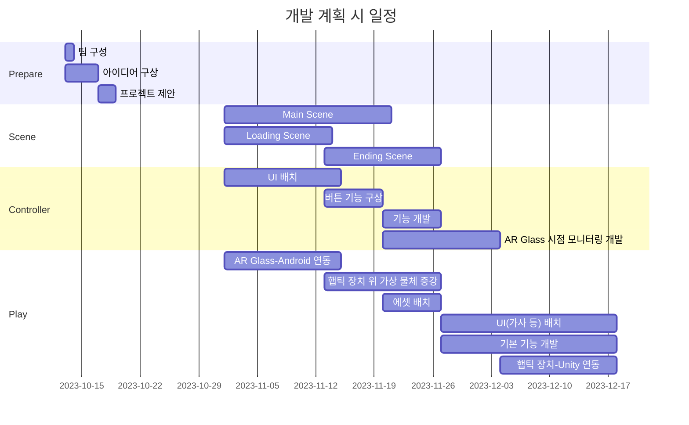
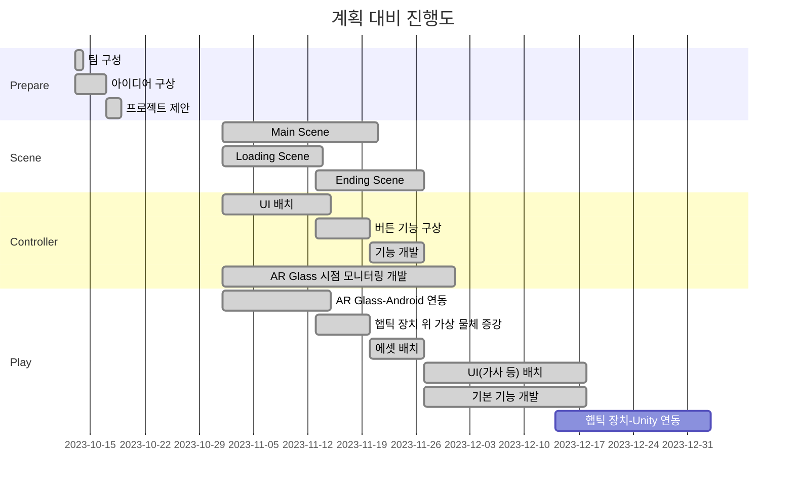

# **AmazingAR**

### 소개
오픈소스 프로젝트를 위한 레포지토리로, AR Glass 기반으로 개발한 교육 및 놀이 콘텐츠 **Amazing AR**입니다.

#### 팀 구성원
| 역할   | 학번 |팀원   |  이메일 |
| ------ | ------ | ------ | ------ |
| **팀장**   | 20210104 | 김경미  | kkm417@kumoh.ac.kr |
| 팀원   | 20210347 | 김현서  | gus952@naver.com |
| 팀원   | 20210862 | 이유정 | lyj98076@naver.com |
| 팀원   | 20210908 | 이지윤 | dl11258963@kumoh.ac.kr |

#### 개발 기간
2023년 10월 13일 ~ 2023년 12월 12일

#### 동영상 링크

 

## 프로젝트 개요

### 개발 배경
</img>
>https://m.dongascience.com/news.php?idx=54780 
http://www.grinews.co.kr/front/news/view.do?articleId=12656 
-  AR 기술은 현재 세계에서 가상 정보를 덧붙여 확장 현실을 제공한다. 이러한 AR 기술은 교육, 엔터테인먼트, 과학 등 여러 분야에서 두각을 보여주고 있다.

- 아동은 원인과 결과를 보다 명확하게 이해하고 학습하기 위해, 시각적 경험과 상호작용을 통해 학습하는 것이 유익하다.  
   이러한 아동을 대상으로 한 교육 및 놀이 콘텐츠를 개발함으로써 그들의 창의성과 인지 능력 증진에 도움을 주고자 한다.

### 필요성
- 다양한 경험 제공
  -  AR 기술을 이용한 음악놀이 콘텐츠를 개발함으로써 아동에게 다양한 환경과 학습을 경험할 수 있는 기회 제공 가능
- 상호작용 강화
  - 악기, 음향 요소 그리고 음악 놀이를 포함한 AR 기술을 통해 일상생활에서 볼 수 없는 악기들을 시각적으로 제시하면서, 아동이 악기와 음악을 체험하고 상호작용할 수 있는 교육적 환경 제공
- 인지 능력 향상
  - 음악 놀이 콘텐츠를 통해 아동의 감각 지각 능력, 상상력, 문제해결 능력 등 향상 가능
 
 

## 프로젝트 개발 내용

### 최종 목표
- 본 프로젝트의 최종 목표는 아동에게 다양한 경험을 제공하고, 이를 통해 개인적인 학습 경험을 가능하게 하는 것이다. 이를 위해 다음과 같은 주요  기능을 개발하였다.
     1. 콘텐츠 선택 : 다양한 음악 놀이 콘텐츠를 제공하여 사용자가 다양한 악기를 체험할 수 있도록 한다.
     2. 음악 놀이 플레이 : AR Glass를 활용하여 사용자가 현실적인 음악 놀이를 경험하고 즐길 수 있도록 한다.
     3. 음악 놀이 모니터링 : 관리자는 사용자의 음악 놀이 진행 상황을 모니터링하고 관리 및 확인함으로써 효과적인 피드백을 제공하여 개인화된 학습 경험을 지원한다.
     4. 결과 분석 : 음악 놀이가 종료되면, 관리자는 사용자의 음악 놀이 플레이 결과를 확인할 수 있다.
     5. 환경 설정 : 각 사용자에 맞게 프로그램의 배경 음악(BGM), 효과음 음량을 조절할 수 있으며, 기기와의 연동 여부를 확인할 수 있다.

### 개발 내용

#### 1. 전체 시스템 구성도
</img>
- 사용자가 AR 글래스를 착용하고 스마트폰을 통해 AR 애플리케이션을 활성화하면 음악 놀이 콘텐츠가 시각화되고 실제 환경으로 증강된다.
- AR Glass를 통해 가상 객체 배치 및 음악을 통해 시각 및 청각 피드백을 제공한다.
- 햅틱 스틱은 사용자의 입력을 받아들이고 촉각 피드백을 제공한다. 이러한 햅틱 스틱을 사용하여 햅틱 패드를 타격할 수 있다.
- 햅틱 패드는 타격 시 인가되는 압력을 측정한다.
- 즉, 가상 환경에서의 시각적 경험과 음악에 의한 청각적 피드백뿐만 아니라, 햅틱 스틱을 통한 촉각적 피드백까지 통합된 경험이 제공된다.   이로써 사용자는 다양한 감각을 활용하여 더욱 몰입하고 개인화된 학습 및 놀이 경험을 즐길 수 있다.

#### 2. 주요 기능별 씬(Scene) 흐름도
-

#### 3. 주요 기능 개발 내용
-

#### 4. 장르 특성화 방안
-

### 오픈 소스 활용

#### 1. 활용한 오픈 소스 소개
- NRSDK
   - NRSDK(Nreal SDK)는 Nreal의 혼합 현실 플랫폼을 위한 Unity 엔진 기반의 개발 도구이다. Mixed Reality 지원, 3D 트래킹 및 공간 인식, Unity 통합, Nreal Light 컨트롤러 지원, 영상 및 음향 처리 기능이 특징이다. 이러한 기능을 통해 현실 세계와 가상 현실을 융합한 차별화된 경험을 제공하는 애플리케이션 개발이 가능하다.
- MAXST
   - MAXST AR SDK는 MAXST의 AR 애플리케이션 개발 도구로, 강력한 트래킹 기술, 3D 오브젝트 인식, 마커리스 트래킹, Unity 통합, 다양한 플랫폼 지원과 같은 다양한 기능을 제공한다. 이를 통해 AR을 활용한 애플리케이션 개발에 유용하게 활용 가능하다.
- Unity Asset Store
  - Unity Asset Store에는 다양한 에셋이 있으며, 오픈소스 에셋을 포함하고 있다. 오픈소스 에셋을 구매하거나 무료로 다운로드하여 프로젝트에 활용할 수 있다. 해당 에셋들은 Unity 엔진과 원활하게 통합되어 있어 Unity 에디터에서 손쉽게 적용 가능하다. 그 중, 이 프로젝트에 활용한 오픈소스는 아래와 같다.
  > Terrain Sample Asset Pack : https://assetstore.unity.com/packages/3d/environments/landscapes/terrain-sample-asset-pack-145808  
     Nature Starter Kit 2 : https://assetstore.unity.com/packages/3d/environments/nature-starter-kit-2-52977  
     Realistic Tree 9 [Rainbow Tree] : https://assetstore.unity.com/packages/3d/vegetation/trees/realistic-tree-9-rainbow-tree-54622  
     Real Stars Skybox Lite : https://assetstore.unity.com/packages/3d/environments/sci-fi/real-stars-skybox-lite-116333  
     Planets of the Solar System 3D : https://assetstore.unity.com/packages/3d/environments/planets-of-the-solar-system-3d-90219  
     Space Star Field Backgrounds : https://assetstore.unity.com/packages/2d/textures-materials/space-star-field-backgrounds-109689  
     Wooden Floor Materials : https://assetstore.unity.com/packages/2d/textures-materials/wood/wooden-floor-materials-150564  
     Christmas Decoration Props : https://assetstore.unity.com/packages/3d/props/interior/christmas-decoration-props-159202  
     Christmas toys : https://assetstore.unity.com/packages/3d/props/interior/christmas-toys-106607  
     Christmas and Birthday Presents Pack : https://assetstore.unity.com/packages/3d/props/interior/christmas-and-birthday-presents-pack-157090  
     Japanese School - Stylized : https://assetstore.unity.com/packages/3d/environments/japanese-school-stylized-221256  
     Minimalist Christmas : https://assetstore.unity.com/packages/3d/environments/minimalist-christmas-50549

#### 2. 오픈 소스 사용법 및 활용한 기능
-

 

### 개발 체계

#### 1) 개발 일정

- 개발 계획 시 일정 대비 개발 진행도 별도 표시

 

   -  AR Glass 시점 모니터링 개발 및 햅틱 장치 위 가상 물체 증강 개발은 예정보다 빠르게 진행되었다.
   - 햅틱 장치-Unity 연동은 햅틱 장치 미완성으로 인해 예정 기간 내에 완성하지 못하였으며, 완성되는 대로 프로젝트에 연동 예정이다.

#### 2) 업무 분장
-

#### 3) 협업 방법 및 활용 툴
-

 

### 사용 설명서
**1) 햅틱패드-햅틱스틱 연결 확인** 
&nbsp;&nbsp;&nbsp;1. 애플리케이션을 실행한다.  
&nbsp;&nbsp;&nbsp;2. 화면 우측 상단에 위치한 설정 버튼()을 탭한다.  
&nbsp;&nbsp;&nbsp;3. 설정 화면이 나타나면, 팝업 창에서 햅틱패드와 햅틱스틱의 연결 상태를 확인할 수 있다.  
&nbsp;&nbsp;&nbsp;&nbsp;&nbsp;- 초록색으로 활성화되고 '연결됨' 메시지가 표시되면, 성공적으로 연결된 상태이다.  
&nbsp;&nbsp;&nbsp;&nbsp;&nbsp;- 초록색이 비활성화되고 '연결 안 됨' 메시지가 표시되면, 연결이 되지 않은 상태이다.  
       
  **2) 상단 위치 기본 기능 버튼** 
   - 화면 상단에 위치한 기본 기능 버튼들은 화면에서 항상 제공된다.  
      - 설정 버튼() : 설정 화면을 띄운다.  
      - 홈 버튼() : 홈 화면으로 이동한다.   
      - 뒤로가기 버튼() : 이전 화면으로 이동한다.  
    
  **3) 음악 놀이 진행** 
&nbsp;&nbsp;&nbsp;3-1) 콘텐츠 선택 
&nbsp;&nbsp;&nbsp;&nbsp;&nbsp; 1. 애플리케이션을 실행한다. 
&nbsp;&nbsp;&nbsp;&nbsp;&nbsp; 2. 로딩 화면이 표시된 후, 자동으로 홈 화면으로 이동한다. 
&nbsp;&nbsp;&nbsp;&nbsp;&nbsp; 3. 콘텐츠 선택 전, 객체 증강을 위해 QR 코드를 먼저 인식해준다. 
&nbsp;&nbsp;&nbsp;&nbsp;&nbsp; 4. 홈 화면에서 하단 중심에 위치한 '콘텐츠 선택' 버튼()을 탭하면, 콘텐츠 선택 화면으로 전환된다. 
&nbsp;&nbsp;&nbsp;&nbsp;&nbsp; 5. 제공된 다양한 콘텐츠 중 원하는 하나를 선택한다. 
&nbsp;&nbsp;&nbsp;&nbsp;&nbsp; 6. 선택한 콘텐츠에 따라 핸드폰 컨트롤러와 AR Glass 화면이 전환된다. 
  
&nbsp;&nbsp;&nbsp;3-2) 음악놀이 기능 
&nbsp;&nbsp;&nbsp;&nbsp;&nbsp;- 선택한 콘텐츠로 화면이 전환되면, 아래와 같은 음악놀이를 제어할 수 있는 버튼들이 제공된다. 
&nbsp;&nbsp;&nbsp;&nbsp;&nbsp;&nbsp;&nbsp;- '선택한 콘텐츠' 재생 버튼() : 선택한 콘텐츠로 음악 놀이를 시작하려면 해당 버튼을 탭한다. 
&nbsp;&nbsp;&nbsp;&nbsp;&nbsp;&nbsp;&nbsp;- '한 번 더!' 다시 시작 버튼() : 선택한 콘텐츠를 처음부터 다시 음악 놀이를 시작하고 싶을 때 사용한다. 
&nbsp;&nbsp;&nbsp;&nbsp;&nbsp;&nbsp;&nbsp;- 음악 감상 버튼() : 선택한 콘텐츠를 감상 모드로 진행하고 싶을 때 해당 버튼을 탭하며, 음악 놀이 없이 음악만 재생된다. 
&nbsp;&nbsp;&nbsp;&nbsp;&nbsp;&nbsp;&nbsp;- 결과 분석 버튼() : 음악 놀이를 종료하며, 결과 화면으로 이동한다. 
&nbsp;&nbsp;&nbsp;&nbsp;&nbsp;&nbsp;&nbsp;- 손 증강 활성화 버튼() : 해당 버튼을 탭하면, 사용자의 손을 따라 햅틱 스틱을 가진 가상의 손으로 증강되어 나타난다. 

&nbsp;&nbsp;&nbsp;3-3) 결과 분석 
&nbsp;&nbsp;&nbsp;&nbsp;&nbsp;- 결과 분석 버튼()을 탭하면, 결과 분석 화면으로 이동한다. 
&nbsp;&nbsp;&nbsp;&nbsp;&nbsp;- 햅틱 장치를 통해 얻은 각각의 점수를 확인할 수 있다. 
&nbsp;&nbsp;&nbsp;&nbsp;&nbsp;- 햅틱 장치에서 얻은 점수를 기반으로 계산된 총 점수가 우측에 가장 크게 나타난다. 
&nbsp;&nbsp;&nbsp;&nbsp;&nbsp;- 하단에 위치한 '콘텐츠 선택' 버튼()을 통해 다른 콘텐츠를 선택할 수 있도록 콘텐츠 선택 화면으로 돌아간다. 
&nbsp;&nbsp;&nbsp;&nbsp;&nbsp;- 하단에 위치한 '한 번 더!' 버튼()을 통해 현재 콘텐츠를 다시 한 번 플레이 한다. 

 

### 고찰

#### 1) 문제 및 해결 방안
-

#### 2) 한계점
- 햅틱 장치의 부재 (2023/12/10 기준)
   - 햅틱 장치의 미완성으로 인해 촉각 피드백 부문에서 완성되지 못하였다.
   - 현재는 시각 및 청각 요소만을 다루고 있으며, 향후 햅틱 장치가 완성되면 프로젝트에 연동하여 촉각 요소를 추가할 예정이다. 이로써 사용자는 시각, 청각, 그리고 촉각의 다양한 감각을 경험하며 더 풍부한 학습 및 놀이 경험을 즐길 수 있도록 한다.
