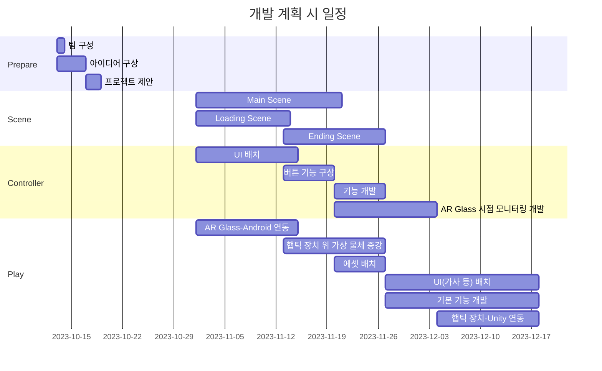
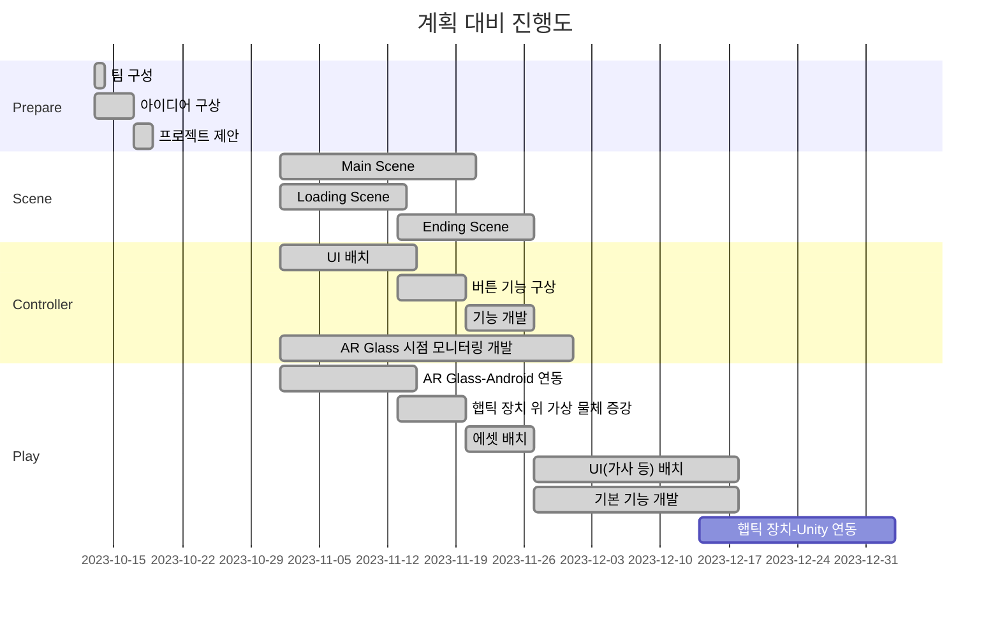

# **AmazingAR**

### 소개
오픈소스 프로젝트를 위한 레포지토리로, AR Glass 기반으로 개발한 교육 및 놀이 콘텐츠 **Amazing AR**입니다.

#### 팀 구성원
| 역할   | 학번 |팀원   |  이메일 |
| ------ | ------ | ------ | ------ |
| **팀장**   | 20210104 | 김경미  | kkm417@kumoh.ac.kr |
| 팀원   | 20210347 | 김현서  | gus952@naver.com |
| 팀원   | 20210862 | 이유정 | lyj98076@naver.com |
| 팀원   | 20210908 | 이지윤 | dl11258963@kumoh.ac.kr |

#### 개발 기간
2023년 10월 12일 ~ 2023년 12월 22일

#### 동영상 링크

 

## 프로젝트 개요

### 개발 배경
</img>
>https://m.dongascience.com/news.php?idx=54780 
http://www.grinews.co.kr/front/news/view.do?articleId=12656 
-  AR 기술은 현재 세계에서 가상 정보를 덧붙여 확장 현실을 제공한다. 이러한 AR 기술은 교육, 엔터테인먼트, 과학 등 여러 분야에서 두각을 보여주고 있다.

- 아동은 원인과 결과를 보다 명확하게 이해하고 학습하기 위해, 시각적 경험과 상호작용을 통해 학습하는 것이 유익하다.  
   이러한 아동을 대상으로 한 교육 및 놀이 콘텐츠를 개발함으로써 그들의 창의성과 인지 능력 증진에 도움을 주고자 한다.

### 필요성
- 다양한 경험 제공
  -  AR 기술을 이용한 음악놀이 콘텐츠를 개발함으로써 아동에게 다양한 환경과 학습을 경험할 수 있는 기회 제공 가능
- 상호작용 강화
  - 악기, 음향 요소 그리고 음악 놀이를 포함한 AR 기술을 통해 일상생활에서 볼 수 없는 악기들을 시각적으로 제시하면서, 아동이 악기와 음악을 체험하고 상호작용할 수 있는 교육적 환경 제공
- 인지 능력 향상
  - 음악 놀이 콘텐츠를 통해 아동의 감각 지각 능력, 상상력, 문제해결 능력 등 향상 가능
 
 

## 프로젝트 개발 내용

### 최종 목표
- 최종 목표 및 주요 기능 소개

### 개발 내용

#### 1. 전체 시스템 구성도
-

#### 2. 주요 기능별 씬(Scene) 흐름도
-

#### 3. 주요 기능 개발 내용
-

#### 4. 장르 특성화 방안
-

### 오픈 소스 활용

#### 1. 활용한 오픈 소스 소개
-

#### 2. 오픈 소스 사용법 및 활용한 기능
-

 

### 개발 체계

#### 1) 개발 일정

- 개발 계획 시 일정 대비 개발 진행도 별도 표시

 

   -  AR Glass 시점 모니터링 개발 및 햅틱 장치 위 가상 물체 증강 개발은 예정보다 빠르게 진행되었다.
   - 햅틱 장치-Unity 연동은 햅틱 장치 미완성으로 인해 예정 기간 내에 완성하지 못하였으며, 완성되는 대로 프로젝트에 연동 예정이다.

#### 2) 업무 분장
-

#### 3) 협업 방법 및 활용 툴
-

 

### 사용 설명서
-

 

### 고찰

#### 1) 문제 및 해결 방안
-

#### 2) 한계점
-
